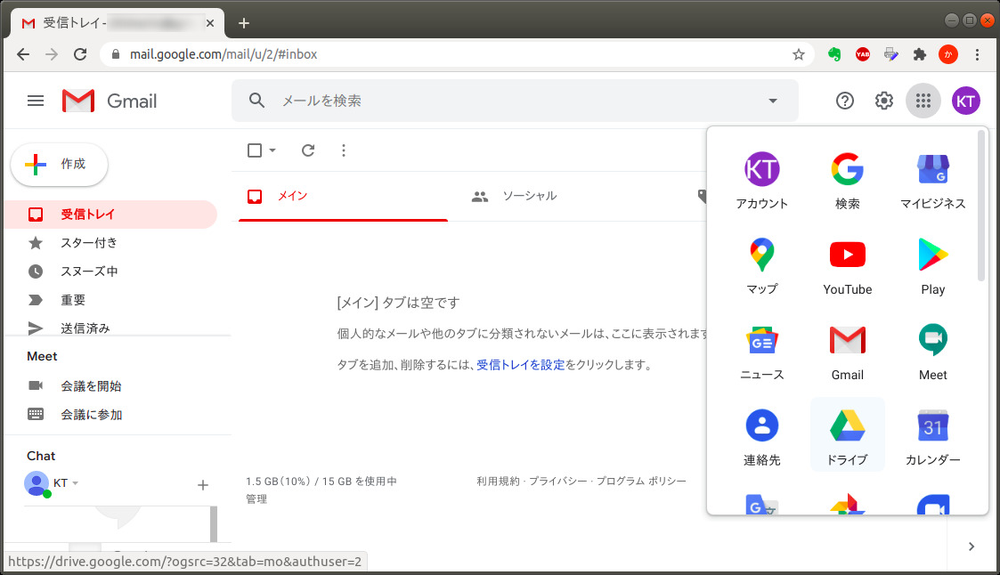
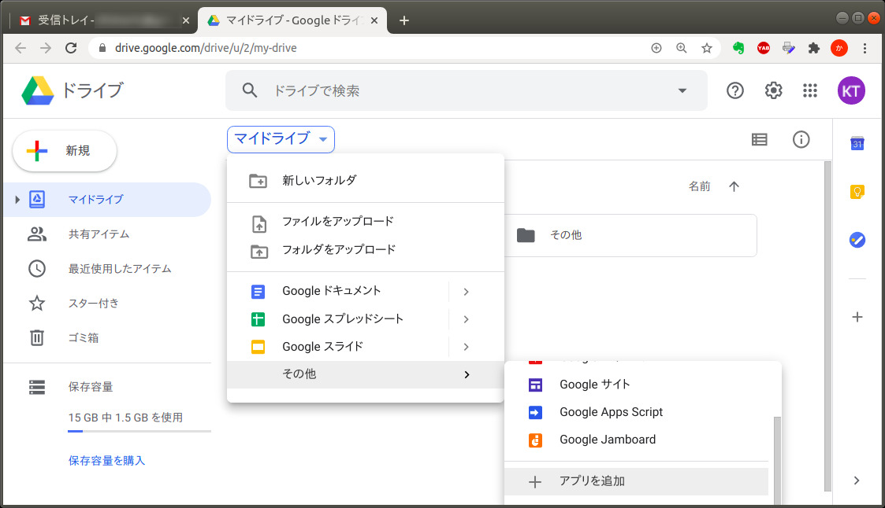
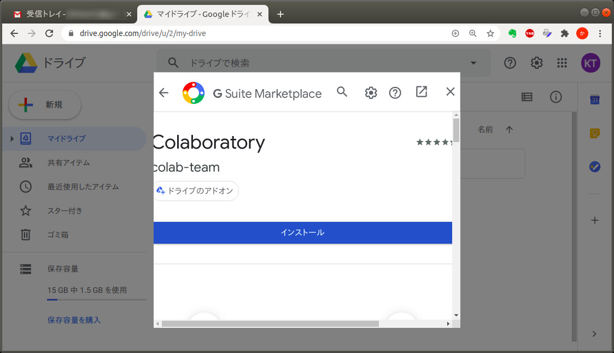
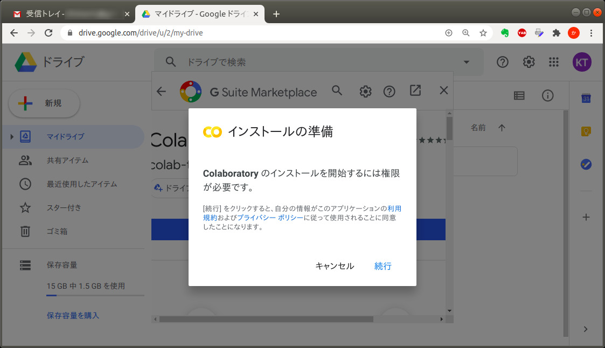
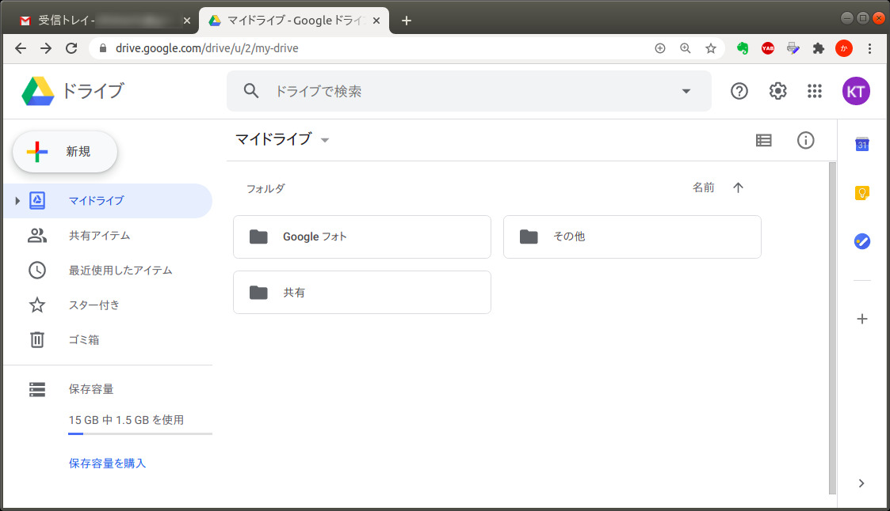
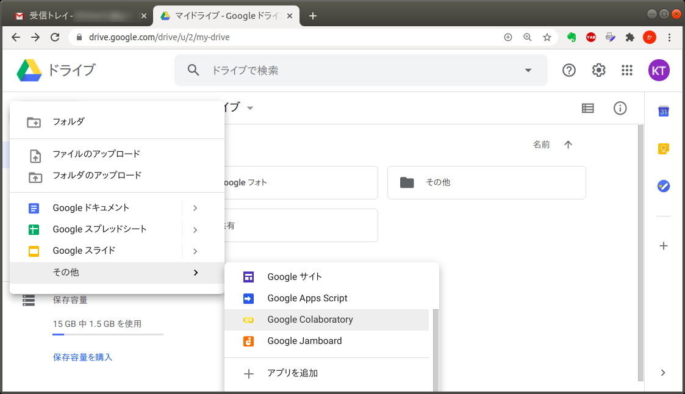
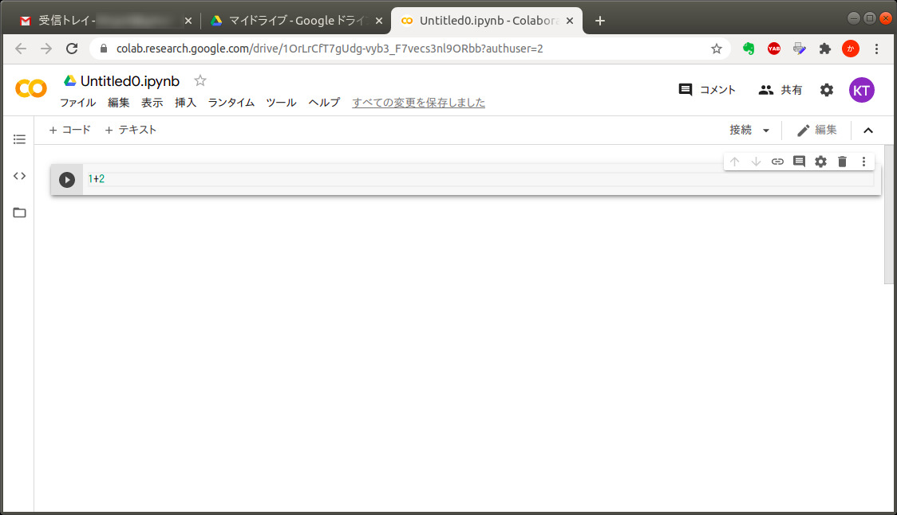
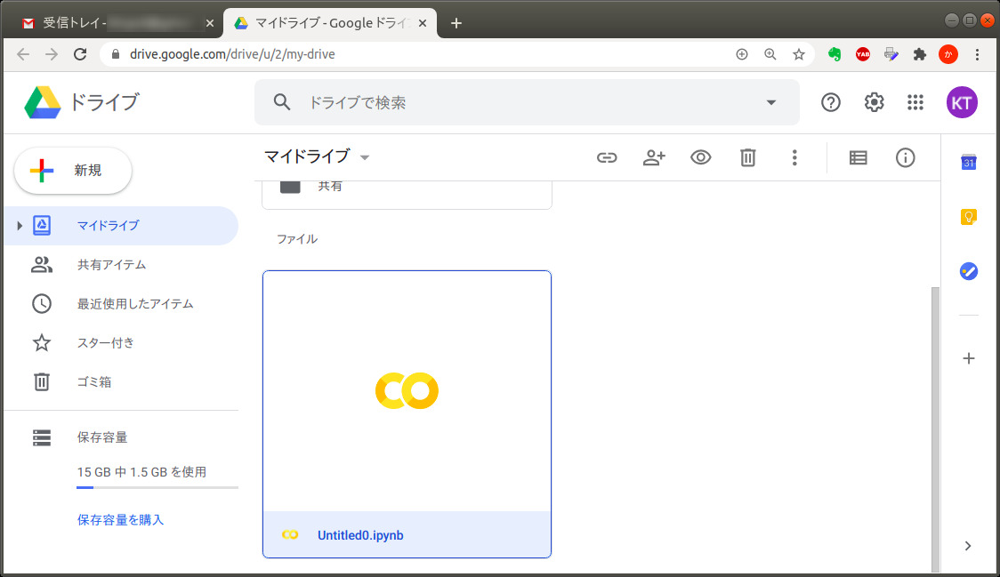

# Colab のインストール

[[目次にもどる](../README.md)]

### Gmail アカウントの取得

* Colab (Google Colaboratory) は，Google のクラウドサービスなので，Gmail アカウントが必要になります．
* 持ってない人は取得してください．（Androidスマホユーザーは持ってるはず）

**
※ 以下の説明では，PC 版 Chrome ブラウザを使用しています．スマホ版や他のブラウザを使うと，表示内容が微妙に異なるかもしれません．
**

### Colab のインストール

Colab の全機能を利用するには，自分の Google アカウントに Colab をインストールします．

* まず，自分のアカウントで「ドライブ」を起動します．

* 「マイドライブ」をクリックして，「その他」「＋アプリを追加」を選びます．
  * サブフォルダを作って，そこで同様の操作をすると，そのフォルダにだけ Colab をインストールできます（他のフォルダに影響を与えない）．

* 検索ボタンをクリックして，

* colaboratory とタイプしていくと，途中で「Colaboratory」がヒットするので，選びます．

* 「インストールボタン」をクリックします．

* 認証を求められるので「続行」をクリックします．

* しばらくするとインストールが完了するので，「OK」をクリックします．

インストールは以上です．

### Colab の動作確認

* ドライブに戻って「新規」をクリックします．

* 「その他」に「Google Colaboratory」が追加されているので，クリックします．

* **【入力】** 先頭のセルに，試しに「1+2」を入力します．

* **【実行】** セルの左端にある実行ボタン（再生ボタンみたいな）をクリックすると，セル内のコードが実行されます．
  * 実行ボタンの代わりに，キーボードで《Ctrl-Enter》（Ctrlキーを押しながらEnterキーを押す）しても，同様に実行できます．
  * ブラウザによっては，《Shift-Enter》でも実行できるかも．

* 実行結果の「3」はクラウド上の Python が計算しています．その結果を Colab がブラウザ上に表示しています．

### Colab ファイルの実行

* ドライブに戻ると，さきほど新規作成した「Untitled0.ipynb」ができています．

* **【Colabファイルの実行】** 該当ファイルをダブルクリックすると，再び Colab が起動します．さきほどの実行結果がちゃんと保存されていますね．

* **【再実行】** これを改めて【実行】すれば，改めて計算がなされます．（この例では，入力が同じなので変わり映えしませんが）
* それ以外の Colabファイルも，同様に，ドライブから開けば実行できます．

動作確認は以上です．

[>>Python を使ってみよう](../python/startup.md)
